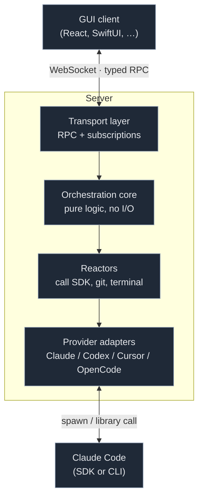
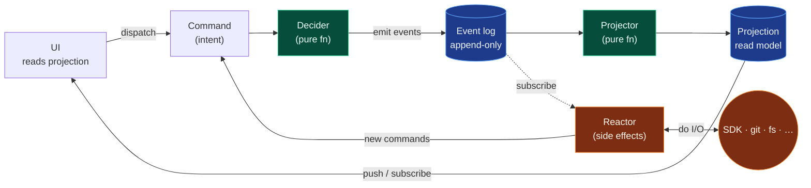
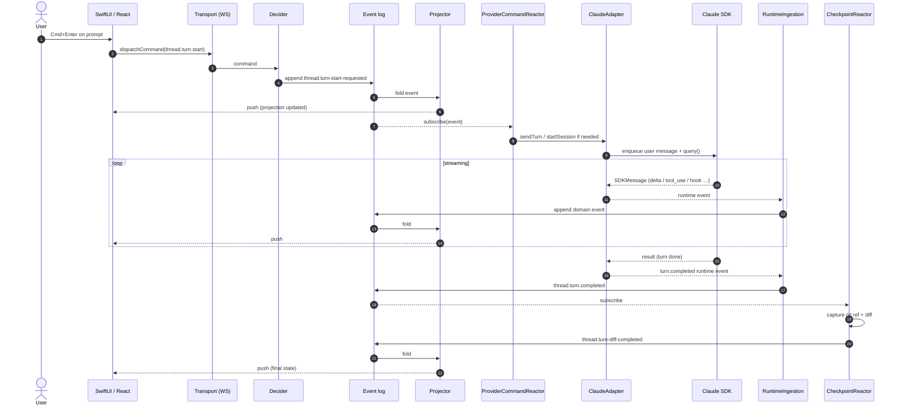
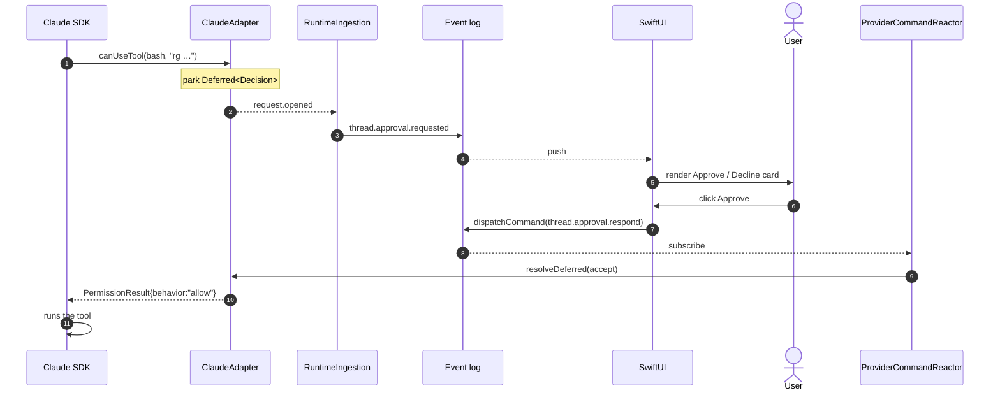

# Building a T3-Style SwiftUI Client for Claude Code — A Walkthrough

Audience: experienced Swift/SwiftUI developer who uses Claude Code CLI daily and wants to build a comparable GUI experience on Apple platforms.

Goal: leave you with a clear mental model of what T3 Code actually does, and a concrete plan for a SwiftUI equivalent. We'll build the mental model first, then translate each piece to Swift/SwiftUI.

Companion docs:
- [`001.00-PROMPT.md`](./001.00-PROMPT.md) — the original research question
- [`001.01-HOW-IT-WORKS.md`](./001.01-HOW-IT-WORKS.md) — reference findings with file:line pointers

---

## Chapter 0 — What you already bring

You already know:

- `claude` CLI: interactive TTY session with tool calls, approvals, slash commands, MCP servers, settings, hooks.
- That Claude Code has a headless mode (`claude -p ...`) that emits structured JSON rather than TTY output. This is our single most important building block.
- SwiftUI, async/await, URLSession, Codable, probably SwiftData or GRDB.

You do *not* need to know:

- Node.js, Effect, React, Turbo, Vite, or any of T3's specific tech choices.
- Event sourcing / CQRS (I'll explain the relevant bits inline).
- WebSocket protocol details (we'll use URLSession's built-in WS).

The architecture we're describing is language-neutral. T3 happens to be Node + React. You'll be Swift + SwiftUI. The interesting patterns are the same.

---

## Chapter 1 — The four shifts you need to internalize

A GUI for a terminal agent isn't a 1:1 port. Four things in your mental model have to move before the rest makes sense.

### Shift 1: "Terminal output" becomes "a stream of typed events"

In the CLI, Claude sends you text. A line at a time. You read it, maybe press `y`, maybe copy something out.

In a GUI, never touch the terminal. Instead, consume the structured SDK message stream — the same thing Claude Code produces in headless mode. Each message is a typed object: `assistant`, `user`, `stream_event`, `hook_started`, etc. You switch over it.

```
CLI mental model:    bytes → terminal emulator → human eyes
GUI mental model:    SDKMessage objects → your state → SwiftUI views
```

This is the biggest leap. The moment you start thinking "parse this line of output" you've lost.

### Shift 2: "Interactive prompts" become "request/response objects with IDs"

In the CLI, "can I run this bash command?" is a blocking prompt. The model waits; you press `y`.

In a GUI, there's no blocking prompt. The agent emits an approval *request* with an `id`, your server parks it in a pending-approval store, the UI renders a button, the user clicks, and you send a *response* back referencing the `id`. The Claude SDK's `canUseTool` callback is exactly this pattern at the library level.

Anything that used to be "user presses a key" is now: `request { id }` → UI → `response { id, decision }`.

### Shift 3: "Ephemeral session" becomes "durable, event-sourced thread"

In the CLI, one session = one process. Close the terminal, it's gone (unless you resume manually).

In a GUI, users expect to:

- open the app tomorrow and see this conversation
- have multiple conversations in a sidebar
- revert a turn
- see git changes made by the agent

So you persist every meaningful thing as an **event** the moment it happens. The current thread view is a **projection** (a fold) over those events. If the app crashes mid-turn, you restart and re-project from events — you never rely on in-memory state.

### Shift 4: "Local process" becomes "client/server — even for a single-user app"

This is the one that feels like overkill but isn't. T3 runs a Node server even when you're using the desktop app locally. Reasons:

1. **SDK lifecycle ≠ UI lifecycle.** If the window closes, the agent keeps running.
2. **Multiple clients.** Desktop app + phone both see the same conversation.
3. **Background work.** Checkpointing with git takes seconds; it shouldn't block UI.
4. **Sandboxing.** The agent touches your filesystem; keep that in one process you control.
5. **Test surface.** The server is testable without a UI.

For a SwiftUI app, this means: consider a **Swift backend process** separate from the SwiftUI UI, communicating over a local WebSocket. Or at least structure your code as if they were separate, so you can split later.

---

## Chapter 2 — Why there's a server (and what it does)

With those four shifts in mind, here's what the server in T3 actually does. Any equivalent Swift backend will need to do the same work, by the same names or different.



Annotations on the four server layers:

- **Transport** — one big RPC (`dispatchCommand`) + N subscription streams.
- **Orchestration core** — `commands → events → projections`. No I/O.
- **Reactors** — side effects triggered by events: runtime ingest, approvals, checkpoints.
- **Adapters** — one per agent; hide the SDK/CLI/JSON-RPC differences.

Four jobs:

1. **Transport** — accept typed commands, emit typed event streams. Authenticate clients. Deal with reconnects.
2. **Orchestration** — turn commands into durable events; project events into a state the UI reads.
3. **Reactors** — when events happen, trigger side effects: call the agent, capture a git checkpoint, clean up a deleted thread.
4. **Adapter per agent** — hide agent-specific details behind a uniform interface. T3 has four; you'll start with one.

The value of keeping these separate: each layer is independently testable, swappable, and debuggable. The orchestration core is pure — you can write it with no network, no SDK, no filesystem.

---

## Chapter 3 — The orchestration model in plain language

This is the part that tends to confuse people. It's simpler than it sounds.

### Vocabulary

- **Command** — an *intent*. "Start a turn on thread X with this prompt." User-triggered or reactor-triggered. Not yet a fact.
- **Domain event** — a *fact*. "Turn Y was requested on thread X at 12:34." Durable, append-only. The source of truth.
- **Decider** — a *pure function*: `(currentState, command) -> events[]`. No I/O. Easy to test.
- **Projection / read model** — the *current view*, built by folding all events. This is what the UI reads and renders.
- **Projector** — the fold function: `(projection, event) -> projection'`. Also pure.
- **Reactor** — a *subscriber* to events. When event E lands, do side effect S (call the SDK, capture a git ref, etc.). Side effects produce new commands, closing the loop.

If you know TCA, the mapping is:

| T3 concept   | TCA concept            |
|--------------|------------------------|
| Command      | Action                 |
| Event        | Action (persisted)     |
| Decider      | Reducer (pure portion) |
| Projection   | State                  |
| Reactor      | Effect                 |

If you know ELM: same story with `Msg` / `update` / `Model` / `Cmd`.

The difference from typical TCA: **events are durable and separable from commands.** You can rebuild state by replaying events without re-running commands. That's what makes crash-recovery and time-travel work.

Here is the whole loop in one picture:



Green = pure (no I/O). Orange = side-effecting. Blue = durable store. Keep the colours straight in your head and 90% of "where should this code live?" questions answer themselves.

### Why this shape

- Rendering = reading a projection → UI is trivially reactive.
- Crash recovery = replaying events → no "where did I leave off" logic.
- Testing = feeding commands into a decider → no mocks.
- New features = new command + new event + update projector.
- Auditability = events are the transcript; you can export them.

You don't need to *name* this pattern event sourcing, but it is, and if you Google "event sourcing CQRS" you'll find everything you'd ever need to know.

---

## Chapter 4 — End-to-end: "I type a prompt and press Enter"

Let's trace a single user turn through every layer. This is the most useful mental exercise for understanding T3.

Set up: a thread already exists, Claude session is not yet running.



Now in prose. Each numbered step below maps to roughly the same step in the diagram, with the extra detail you need the first time you read it.

### Step 1 — The user action

User types "refactor `deriveWorkLogEntries` to handle nil inputs" and presses Cmd+Enter.

In SwiftUI terms: a view owns a `@State var draft: String`. The send button calls a view-model method that needs to dispatch an orchestration command.

### Step 2 — Client dispatches a command

The client doesn't call an agent-specific method. It dispatches one command:

```jsonc
{
  "type": "thread.turn.start",
  "threadId": "thread_abc",
  "commandId": "cmd_xyz",
  "prompt": [{ "kind": "text", "text": "refactor..." }],
  "createdAt": "..."
}
```

It goes over the single `orchestration.dispatchCommand` RPC. Response: the sequence number that this command produced.

### Step 3 — Server decider produces events

The orchestration core receives the command. The decider looks at the current thread projection, validates invariants (does thread exist? is one already in flight?), and emits events:

```
thread.turn-start-requested { turnId, threadId, prompt, ... }
```

These events are written to the durable event log (SQLite). The projection pipeline folds them and updates the read model: thread gets `orchestrationStatus: "running"`, a new turn is appended, etc.

### Step 4 — Reactor sees the event

`ProviderCommandReactor` subscribes to domain events. When it sees `thread.turn-start-requested` it:

1. Looks up whether a Claude session is already open for this thread.
2. If not, calls `ClaudeAdapter.startSession(...)`. This spawns a fiber that:
   - Calls the Claude SDK's `query({ ... })` with a prompt queue, the `canUseTool` callback, the `pathToClaudeCodeExecutable`, etc.
   - Gets back an async iterable of `SDKMessage` objects.
3. Pushes the user message onto the prompt queue, triggering `ClaudeAdapter.sendTurn`.

### Step 5 — The SDK does its thing

The SDK starts streaming messages back: stream events containing `content_block_delta` messages with partial text, `tool_use` messages when the model wants to call a tool, hook events, etc.

Each of these becomes a **runtime event** emitted by the adapter onto an internal event queue. Examples:

- `content.delta { itemId, kind: "assistant_text", text }`
- `item.started { itemId, itemType: "command_execution", command }`
- `request.opened { requestId, kind: "command", tool, input }` (approval needed)
- `hook.started { id, name }`

### Step 6 — Runtime ingestion: runtime events → domain events

`ProviderRuntimeIngestion` consumes the runtime event stream. Its job is to translate provider-specific runtime events into domain concepts:

- `content.delta` → `thread.message.delta` domain event (streaming mode) or buffered until `complete`
- `item.started/updated/completed` → `thread.activity.*` events
- `request.opened` → `thread.approval.requested` event
- `hook.started/completed` → `thread.activity.hook-*` events

Each domain event gets a sequence number and is written to the event log. The projector folds it into the thread projection.

### Step 7 — Projection pushed to the client

Any client subscribed to `orchestration.subscribeThread(threadId)` receives a live push every time a new domain event is projected. The payload includes the event plus any projection update.

### Step 8 — SwiftUI renders

Your SwiftUI store receives the push, updates its `@Observable` state, and the view re-renders. Streaming text appears character-by-character (or chunk-by-chunk, depending on how fast you render).

### Step 9 — Approval arrives

At some point the model wants to run `rg 'deriveWorkLogEntries'`. The SDK calls `canUseTool(...)`. The adapter:

1. Checks the thread's runtime mode. If `full-access`, allows immediately.
2. If `approval-required`, emits a `request.opened` runtime event. Ingestion turns that into a `thread.approval.requested` domain event.
3. Parks a `Deferred<Decision>` keyed by request id. Does not return from `canUseTool` yet.
4. UI receives the approval event, renders "Can I run `rg ...`? [Approve] [Decline]".
5. User clicks Approve. Client dispatches `thread.approval.respond { requestId, decision: "accept" }` command.
6. Server handles that command → emits `thread.approval.resolved` event.
7. `ProviderCommandReactor` resolves the parked `Deferred`.
8. `canUseTool` returns `{ behavior: "allow" }` to the SDK.
9. SDK runs the tool, and we loop back to Step 5.



Note that the approval object lives in the event log. If the user closes the laptop and opens the iPhone, the iPhone sees the pending approval and can resolve it — nothing about this flow is tied to a single client.

### Step 10 — Checkpoint

When the turn finishes (SDK emits a `result` message, adapter emits `turn.completed`), `CheckpointReactor` sees the domain event and captures a git checkpoint (a hidden ref) and computes the turn diff. That diff summary becomes another domain event. The UI shows "+45 −12, 3 files changed" on the turn.

**That's one turn.** Everything else in T3 is variations on this loop.

---

## Chapter 5 — How terminal features get translated to the GUI

Short table of the mapping:

| Terminal affordance          | GUI version                                                               |
|------------------------------|---------------------------------------------------------------------------|
| Reading scrolling output     | Timeline view with auto-scroll; virtualized list; stream partial text    |
| `y/n` approval prompt        | Approval card with 4 buttons (Cancel turn / Decline / Approve once / Allow for session) |
| `/model`, `/plan` commands   | Composer slash-command menu; intercepted in the UI                        |
| MCP tool calls               | Rendered as regular tool-call rows, different icon                        |
| Tool execution output        | Inline expandable panel under the tool-call row                           |
| "thinking..." status         | Derived from `session.orchestrationStatus`; spinner row in timeline       |
| Plan mode                    | Proposed-plan banner with accept/reject controls                          |
| "Ctrl+C to interrupt"        | Stop button that dispatches `thread.turn.interrupt` command               |
| `claude resume`              | Selecting a thread from the sidebar → adapter starts session with `resumeCursor` |
| Shell access                 | xterm panel backed by a PTY running on the server                         |

Two things worth calling out:

- **Bash the Claude tool vs. Bash the user feature** are distinct. The agent calling Bash is a tool call; the user opening a terminal tab is a separate PTY session. Don't conflate them.
- **Plan mode is bi-directional**: the SDK sends the plan via `ExitPlanMode`, you show it to the user, they accept or reject, you send the decision back.

---

## Chapter 6 — Translating to SwiftUI concretely

### Client state

Use `@Observable` (Observation framework) for simple projects. Use TCA if you like the discipline — it maps directly to the orchestration model.

```swift
@Observable
final class ThreadStore {
    private(set) var threads: [ThreadID: ThreadProjection] = [:]
    private(set) var latestSequence: Int64 = 0

    func apply(_ event: DomainEvent) {
        // pure projector — same shape as T3's projector.ts
        threads = project(threads, event)
        latestSequence = max(latestSequence, event.sequence)
    }
}
```

The store is the projection. Views read from it; transport writes to it.

### WebSocket transport

`URLSessionWebSocketTask` is adequate for MVP. For a resilient transport like T3's `wsTransport.ts`, wrap it with:

- a reconnect loop with exponential backoff
- per-subscription auto-resubscribe
- a sequence-gap detector that calls `replayEvents(fromSequence:)` when gaps appear

Shape:

```swift
actor WSTransport {
    enum State { case connecting, open, reconnecting, closed, disposed }
    func request<R: Decodable>(_ method: String, payload: Encodable) async throws -> R
    func subscribe<E: Decodable>(_ method: String, payload: Encodable) -> AsyncStream<E>
}
```

Use an actor for thread safety. Each subscription is an `AsyncStream` that survives reconnects by looping inside.

### Shared contracts

This is the nastiest part cross-language. T3 gets away with a single schema source of truth because both sides are TypeScript. You have four options:

1. **Hand-maintain Swift mirror types.** Tedious but simple. Works when the schema stabilizes.
2. **Generate Swift from a shared schema.** Define your commands/events in JSON Schema or OpenAPI (or `.proto` if you use gRPC), codegen to Swift. Protobuf + SwiftProtobuf is one option. OpenAPI + openapi-generator is another.
3. **Use Effect schemas and a JSON Schema export.** T3's schemas can dump JSON Schema via `schemaJson` utilities. Generate Swift from that.
4. **Write schemas in Swift and codegen JSON Schema the other direction.** Less common, but works if Swift is the source of truth.

For MVP, start with option 1. Move to 2 or 3 once the schema settles.

### Rendering streaming text

SwiftUI `Text` is happy to re-render on each delta. For long transcripts, use `LazyVStack` inside a `ScrollView`, or `List` with row identities derived from `(turnId, blockId)`. Don't try to render thousands of tokens as one giant `Text` view — split by block.

For markdown: `AttributedString(markdown:)` handles most cases. `swift-markdown` from Apple covers more if you need.

### Keybindings

`.keyboardShortcut(_:modifiers:)` on buttons plus a command palette view. T3 has a `keybindings.json` with `when` clauses; for MVP you can hard-code. A proper context-aware dispatcher (`when: "terminalFocus"` etc.) is easy to write as a dictionary keyed on view-state flags.

### Persistence

- **SQLite via GRDB** for the event log. Events are append-only, schema is trivial: `id`, `sequence`, `type`, `payload_json`, `created_at`. Index on `(threadId, sequence)`.
- **In-memory projection**, rebuilt on launch by replaying events. Optionally snapshot the projection every N events to speed up startup.
- **SwiftData** works if you prefer modern stack. Keep the event schema stable — migrating events is painful.

### Git checkpoints

Shell out to `git`. Use `Process` with an `stdin`/`stdout` pipe. Capture checkpoints as refs under a namespace like `refs/t3/checkpoints/<turnId>`. Diff via `git diff <ref1> <ref2>`.

---

## Chapter 7 — The SDK bridge problem

There is no Swift `@anthropic-ai/claude-agent-sdk`. You have four options, roughly in order of pragmatism:

```mermaid
flowchart TB
    subgraph A["Option A · Spawn claude CLI (recommended MVP)"]
        direction LR
        A1["SwiftUI app"] --> A2["Swift adapter"]
        A2 -->|"NDJSON stdio"| A3["claude --print<br/>--output-format stream-json"]
        A3 --> A4(("Anthropic API"))
    end

    subgraph B["Option B · Node sidecar"]
        direction LR
        B1["SwiftUI app"] --> B2["Swift adapter"]
        B2 -->|"JSON over pipe/socket"| B3["Node sidecar<br/>uses JS SDK"]
        B3 --> B4(("Anthropic API"))
    end

    subgraph C["Option C · Reuse T3 server"]
        direction LR
        C1["SwiftUI client<br/>speaks Effect-RPC"] -->|"WebSocket"| C2["T3 Node server"]
        C2 --> C3["ClaudeAdapter"]
        C3 --> C4(("Anthropic API"))
    end

    subgraph D["Option D · Reimplement SDK in Swift (don't)"]
        direction LR
        D1["SwiftUI app"] --> D2["Hand-rolled Swift SDK"]
        D2 --> D4(("Anthropic API"))
    end

    classDef recommended fill:#064e3b,stroke:#34d399,color:#ecfdf5;
    classDef avoid fill:#7f1d1d,stroke:#fca5a5,color:#fef2f2;
    class A recommended;
    class D avoid;
```



Stack depth increases left-to-right inside each option; your control decreases right-to-left. Option A gives you the shortest stack and the most control over behaviour; Option C gives you four agents for free but puts T3 between you and the SDK; Option D gives you a second job.

### Option A: Spawn `claude` in headless streaming mode (recommended for MVP)

`claude` itself has a non-interactive mode that emits structured JSON. The exact flags evolve — check `claude --help` — but the general shape is:

- `--print` (or `-p`) for one-shot non-interactive
- `--output-format stream-json` to emit NDJSON of SDK messages
- `--input-format stream-json` to accept a stream of user messages via stdin
- `--permission-prompt-tool <tool>` (or equivalent) for bi-directional approvals

In Swift, spawn the binary with `Process`, wire up `FileHandle` pipes for stdin/stdout, and parse one JSON object per line:

```swift
let proc = Process()
proc.executableURL = URL(fileURLWithPath: "/usr/local/bin/claude")
proc.arguments = ["--print", "--output-format", "stream-json", "--input-format", "stream-json"]

let stdout = Pipe(), stdin = Pipe()
proc.standardOutput = stdout
proc.standardInput = stdin
try proc.run()

for try await line in stdout.fileHandleForReading.bytes.lines {
    let msg = try decoder.decode(SDKMessage.self, from: Data(line.utf8))
    await ingest(msg)
}
```

This is exactly what T3 is doing, just one layer deeper (T3 calls the SDK, the SDK spawns the CLI).

### Option B: Node sidecar

Ship a tiny Node process with your app that uses the official SDK and speaks a simple JSON protocol to your Swift app over stdio or a local socket. Heavier dependency, but you get all SDK features without being at the mercy of CLI flag changes.

### Option C: Reuse T3's server

Build only the SwiftUI client; point it at T3's Node server. You'd need to implement the Effect-RPC wire format in Swift. Doable — it's JSON under the hood — but nontrivial. Upside: every agent (Codex, Cursor, OpenCode) works for free.

### Option D: Reimplement the SDK in Swift

Don't. The SDK is a lot of code that will keep changing. You'll spend a year chasing upstream.

Recommendation for your situation: **Option A for the first month.** Prove the pipe works, render messages, handle approvals, get to "I can have a conversation and approve tools from SwiftUI." Then decide whether to invest in B (more features) or C (more agents).

---

## Chapter 8 — Suggested MVP build order

This is the order I'd build in. Each step is testable and shippable on its own.

```mermaid
flowchart LR
    S1["1 · The pipe<br/><small>Process + NDJSON</small>"]
    S2["2 · Timeline<br/><small>SwiftUI List</small>"]
    S3["3 · Tool calls<br/><small>classify + render</small>"]
    S4["4 · Approvals<br/><small>request/response</small>"]
    S5["5 · Event log<br/><small>GRDB</small>"]
    S6["6 · Resume<br/><small>--resume sessionId</small>"]
    S7["7 · Checkpoints<br/><small>git refs + diff</small>"]
    S8["8 · Client/server split<br/><small>Swift backend + WS</small>"]
    S9["9 · Multi-thread<br/><small>sidebar</small>"]
    S10["10 · Polish<br/><small>markdown / shortcuts</small>"]

    S1 --> S2 --> S3 --> S4 --> S5 --> S6 --> S7 --> S8 --> S9 --> S10

    classDef weekend fill:#064e3b,stroke:#34d399,color:#ecfdf5;
    classDef week fill:#78350f,stroke:#fbbf24,color:#fffbeb;
    classDef month fill:#7f1d1d,stroke:#fca5a5,color:#fef2f2;
    classDef ongoing fill:#1e3a8a,stroke:#60a5fa,color:#eff6ff;
    class S1,S2,S3,S4 weekend;
    class S5,S6,S7 week;
    class S8 month;
    class S9,S10 ongoing;
```



Green = a weekend each. Orange = a week-ish each. Red = the big architectural lift. Blue = ongoing. The temptation is to skip ahead to Step 8 before Step 5 because "client/server is the interesting part"; resist it. Each earlier step teaches you something about the message shape that the later steps assume.

### Step 1 — The pipe

Goal: spawn `claude -p --output-format stream-json`, send a single prompt, print every SDK message to the console. No UI yet.

- `Process` + pipes
- NDJSON line reader
- `SDKMessage` Codable enum (at minimum: `system`, `assistant`, `user`, `result`)

When this prints a sensible conversation, you're ready for UI.

### Step 2 — Minimum SwiftUI timeline

Goal: one text field to type a prompt, one `List` that shows streaming assistant text.

- Add a `TurnStore` (`@Observable`) that accumulates content blocks.
- Render `List(store.rows)` with a `ForEach` over rendered blocks.
- On "send," enqueue a user message onto the subprocess's stdin.

### Step 3 — Tool call rendering

Goal: when the model calls a tool, render a dedicated row ("Bash: `ls -la`" with an expandable output panel).

- Classify tool calls (bash, edit, read, grep, mcp, etc.) — borrow T3's `classifyToolItemType` table.
- Render per-class icon + label.
- Collect tool result blocks and show them inline.

### Step 4 — Approvals

Goal: in supervised mode, tool calls pause for a user decision.

- Hook into the CLI's approval mechanism (check current flags; likely `--permission-prompt-tool` or a similar MCP-based approval callback).
- Render an "Approve / Decline / Always allow" card in the timeline.
- Send the decision back over the CLI's approval channel.

### Step 5 — Event log + projections

Goal: quit the app, reopen it, see the conversation as you left it.

- SQLite via GRDB. Table: `events(thread_id, sequence, type, payload_json, ts)`.
- Every SDK message you consume becomes one or more domain events (you get to choose granularity).
- On launch, replay events for the active thread to rebuild the projection.

### Step 6 — Session resume

Goal: restart the app mid-conversation and continue with Claude remembering the prior turns.

- Use Claude's `--resume <session-id>` flag (or the SDK's resume option).
- Store the session id on your thread record; pass it on next start.

### Step 7 — Checkpoints and diffs

Goal: "what changed during this turn?"

- `git stash create` or a detached commit on a hidden ref before and after each turn.
- Diff the two refs. Show changed-files list on the turn row.
- Add a "revert this turn" button → `git restore` to the before ref.

### Step 8 — Split into client + server

Goal: run the agent on a Mac mini; connect from your laptop and iPhone.

- Introduce a Swift server process that owns the event log and the `Process`-based Claude subprocess.
- Define your WebSocket protocol. Start narrow: one RPC (`dispatchCommand`), one subscription (`subscribeThread`).
- Port the SwiftUI client to talk to the server instead of the subprocess directly.

### Step 9 — Multi-thread + sidebar

Goal: multiple conversations.

- Thread list view.
- Thread creation command.
- Per-thread subscription multiplex.

### Step 10 — Polish

- Markdown rendering, syntax highlighting in code blocks.
- Keyboard shortcuts.
- Search across threads.
- Global command palette.
- Checkpoints UI (timeline of snapshots).

At that point you have something that looks and feels like T3, in SwiftUI, understanding your own stack end-to-end.

---

## Chapter 9 — Pitfalls T3 learned (and you can skip)

1. **Never parse terminal output.** Always consume structured SDK messages. If a feature can't be expressed in the message stream, it can't be in the GUI.

2. **Don't tie UI state to adapter/SDK state directly.** Go through the event log. If the adapter dies, your UI still has something to render.

3. **Sequence numbers on every event are not optional.** Without them, reconnects silently drop updates. On reconnect, ask the server for "events after sequence X."

4. **Make async work deterministic.** T3 uses "drainable workers" and a "runtime receipt bus" so tests can wait for the system to become idle without sleeping. When you find yourself adding `Task.sleep(for: ...)` in tests, instead emit a "this async thing finished" signal and wait on it.

5. **Ordering matters for pushes.** If `turn.started` arrives after `message.delta`, your UI will render a delta on a non-existent turn. Serialize per-thread pushes.

6. **Adapter interface from day one.** Even if you only ship Claude, put it behind a `ProviderAdapter` protocol. Adding Codex or another agent later is a days-of-work problem, not a weeks-of-work problem.

7. **Approvals are first-class objects, not modal dialogs.** A pending approval is a persistent record with an id. The UI reflects it; the UI doesn't own it.

8. **Checkpoint before the turn, not after.** If the app crashes mid-turn, you want the pre-turn snapshot to exist.

9. **Every turn ends with a "quiesced" signal.** The UI shouldn't guess. The server emits a typed signal when all follow-up work (projections, checkpoints, diffs) is done.

10. **Keep the orchestration core pure.** No network, no filesystem, no SDK calls. Reactors do I/O; the decider and projector don't. This makes tests and replay trivial.

---

## Appendix: T3 file pointers cross-referenced by concept

Use these when you want to see how T3 actually implements something:

| Concept                       | T3 file                                                                  |
|-------------------------------|--------------------------------------------------------------------------|
| Claude SDK wrapper            | `apps/server/src/provider/Layers/ClaudeAdapter.ts`                       |
| Tool classification table     | `ClaudeAdapter.ts:~395` (`classifyToolItemType`)                         |
| `canUseTool` approval flow    | `ClaudeAdapter.ts:~2652` (`canUseToolEffect`)                            |
| Adapter interface             | `apps/server/src/provider/Services/ProviderAdapter.ts`                   |
| Adapter registry              | `apps/server/src/provider/Layers/ProviderAdapterRegistry.ts`             |
| Commands → events (decider)   | `apps/server/src/orchestration/decider.ts`                               |
| Events → projection           | `apps/server/src/orchestration/projector.ts`                             |
| Command reactor               | `apps/server/src/orchestration/Layers/ProviderCommandReactor.ts`         |
| Runtime event ingestion       | `apps/server/src/orchestration/Layers/ProviderRuntimeIngestion.ts`       |
| Checkpoint reactor            | `apps/server/src/orchestration/Layers/CheckpointReactor.ts`              |
| Event log storage             | `apps/server/src/persistence/`                                           |
| Transport handlers            | `apps/server/src/ws.ts`                                                  |
| Shared contracts              | `packages/contracts/src/orchestration.ts`, `rpc.ts`                      |
| Client transport              | `apps/web/src/rpc/wsTransport.ts`                                        |
| Sequence-gap recovery         | `apps/web/src/orchestrationRecovery.ts`                                  |
| Projection selectors          | `apps/web/src/session-logic.ts`, `storeSelectors.ts`                     |
| Timeline rendering            | `apps/web/src/components/chat/MessagesTimeline*.ts(x)`                   |
| Approval UI                   | `apps/web/src/components/chat/ComposerPendingApproval*.tsx`              |
| Composer slash commands       | `apps/web/src/composer-logic.ts`                                         |
| PTY terminal                  | `apps/server/src/terminal/`, `apps/web/src/components/ThreadTerminalDrawer.tsx` |

Cross-reference with [`001.01-HOW-IT-WORKS.md`](./001.01-HOW-IT-WORKS.md) for deeper reference.
